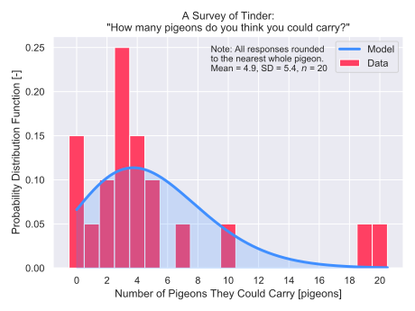

# :bird: Pigeons

*by Peter Sharpe*

Someone in my grad school cohort (let's call her Sydney, because her name is Sydney) recently asked me "How many pigeons do you think you could carry?". 

It honestly really threw me for a loop. I thought about it for a long while and eventually came up with the answer 18, since I think I could stuff quite a few pigeons in a trench coat. (Might be painful, but I could make it a block or so?)

But I wanted to see what other people thought they could manage, so I crowdsourced data from the most reliable data collection website I could think of: Tinder. (The best part was that this was totally free - I just had to mortgage my dating life for a little while!)

Shoutout goes to our outlier, Yasmeen from Harvard, who simply replied "How many fit on a skewer?" (Some back-of-the-napkin math on average skewer length converted this to around 10 pigeons.) You live your best life, Yasmeen. :clap:

Data will be updated periodically. Feel free to contribute - open up an issue ticket and post your data, and I'll add it!
