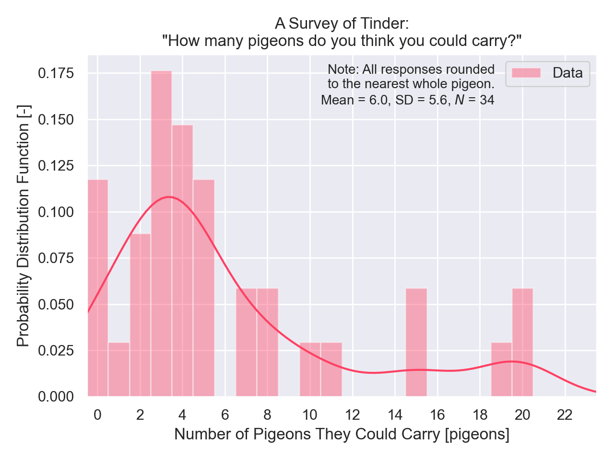

One of my grad school friends, Sydney, recently asked me "How many pigeons do you think you could carry?"

Honestly, it really threw me for a loop. I thought about it and came up with 18 pigeons, since I figured I could stuff quite a few pigeons in a trench coat.

My labmates and I wanted to see what other people thought they could manage, so I crowdsourced data from the most reliable data collection website I could think of: Tinder. (The best part was that this was totally free - I just had to mortgage my dating life for a little while!)

  

Also featuring art by my sister, [Julie Sharpe](https://www.instagram.com/juliesharpeart/), depicting her impression of what aerospace engineers could do if they got creative with pigeons:

### Hall of Fame

* Tiffany, 20 pigeons "using tranquilizer darts and a hiking backpack"
* Yasmeen, 10 pigeons "how many fit on a skewer?"

### Rules

* Live pigeons.
* Yes, like the ones at the park.
* No, you can't train them.
* Well, I guess you're allowed to sedate them, but only if it's in a cruelty-free way, and you also have to carry the sedation equipment too.
* Bags are fine, but remember that pigeons weigh almost 2 pounds apiece and are as big as like, a large orange. No Travis, you can't carry 250 of them in a bag. Yes, I know you've been working out.

### Links

Quick link: [tiny.cc/tinderpigeons](http://tiny.cc/tinderpigeons)

[Long Link](https://peterdsharpe.github.io/pigeons/)

[Code (GitHub repository)](https://github.com/peterdsharpe/pigeons)

[Raw data](https://github.com/peterdsharpe/pigeons/blob/master/data.csv)